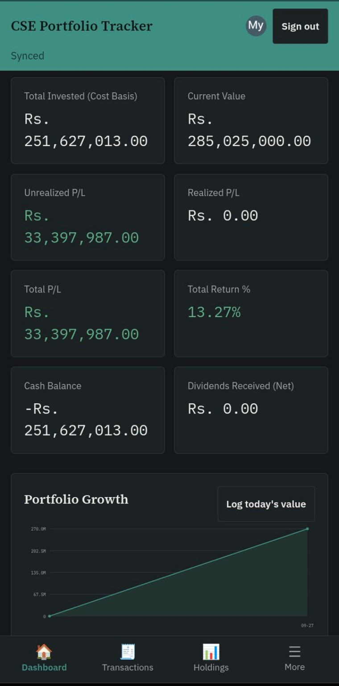
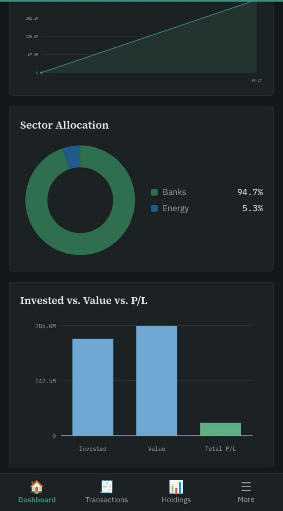

# CSE Portfolio Tracker

An offline-first, installable web app for tracking a Colombo Stock Exchange (CSE)
portfolio — transactions, holdings, dividends, cash flow, sector allocation, and
stop-loss/target levels. Rebuilt from an Excel workbook (`CSE Offline Excel
Portfolio Tracker`) into a mobile-friendly PWA that runs as a static site,
with a static GitHub Pages frontend and Firebase Authentication/Firestore for account sync.

**All prices are entered manually.** This app has no connection to any live CSE
data feed. It is a ledger, not a trading platform, and nothing in it is
investment advice.

**[Open the live app](https://j-kavindu.github.io/cse-portfolio-tracker/)** · [View the source](https://github.com/j-kavindu/cse-portfolio-tracker)

## Mobile preview

Screenshots from the mobile app. Portfolio values and prices are manually entered; they are not a live market feed.





---

## 1. What the original workbook did

The workbook had 8 sheets:

- **Portfolio Dashboard** — KPI summary (Total Invested, Current Value, Total
  P/L, Total Return %, Cash Balance, Dividends Received) plus an expected-return
  input and 3/6/12-month projections, with 4 embedded charts: a portfolio growth
  line chart, a sector-allocation pie chart, a KPI bar chart, and a projection
  bar chart.
- **Transactions** — the source of truth: Date, Symbol, Buy/Sell, Quantity,
  Price, a global Brokerage % (cell `J2`), with Fee and Total Value formulas.
- **Holdings** — one row per symbol, entirely derived from Transactions via
  `SUMIFS`: quantity, weighted average buy price, total cost, and (with a
  manually-entered current price) market value, unrealized P/L, and portfolio
  weight. Sector was a manual dropdown sourced from a fixed 20-sector list.
- **Stop Loss & Targets** — per-symbol stop-loss/target percentages, computed
  prices, and a HOLD / STOP LOSS HIT / TARGET HIT status via `VLOOKUP` into
  Holdings.
- **Dividends** — per-symbol dividend records; shares held is computed from
  Transactions strictly *before* the record date, with a flat 15% withholding
  tax.
- **Sector Summary** — market value per sector (`SUMIF` against Holdings).
- **Cash Flow** — net trading cash, dividends received, and a manual cash
  adjustment input, summing to a cash balance.
- **Performance Analysis** — a manually-logged (date, value) history feeding the
  growth chart, plus one live "auto portfolio value" cell.

## 2. Ambiguities found, and how this app resolves them

The brief asked me to state my interpretation before implementing anything the
workbook left unclear — three points needed a decision:

1. **Total Cost never reduced when shares were sold.** `Holdings!F` summed
   *every* historical BUY for a symbol, regardless of later sells. After a
   partial sell, Unrealized P/L compared the current market value against a
   cost basis that still included the cost of shares no longer held; after a
   *full* sell, the position vanished from Quantity but Total Cost stayed at
   its full historical value, which would show as a 100% loss on a symbol that
   might have been sold at a profit.
   **Fix:** holdings use a moving weighted-average-cost method
   (`js/calculator.js: replaySymbol`) that reduces the cost basis proportionally
   on every sale and books the difference as **Realized P/L**, tracked
   separately from Unrealized P/L. A fully-exited symbol drops out of Holdings
   entirely rather than showing a phantom loss.
2. **The Cash Flow sign convention worked backwards.** `Transactions!G` applied
   `qty*price + fee` to both BUY and SELL rows and only negated the sell side,
   so a sale's fee was added to what looks like an outflow instead of being
   subtracted from the proceeds; `Cash Flow!B3` then combined those already-
   negative sell figures in a way that made the cash balance fall further with
   every sale instead of rising.
   **Fix:** `transactionCashImpact()` uses the standard convention — a BUY is
   `-(qty*price + fee)` and a SELL is `+(qty*price - fee)` — so selling
   increases cash and fees always reduce whoever pays them.
3. **The 3-month projection used a different base than the 6- and 12-month
   ones** (`Total Invested` vs. `Current Value` — almost certainly a copy
   error). **Fix:** all three horizons project forward from current portfolio
   value.

Two smaller, deliberate extensions (not new "features," just what's necessary
to operate the corrected logic above):
- **Realized P/L** is now a first-class dashboard figure, since correcting
  point 1 requires somewhere to put the P/L from shares already sold.
- **Manual Cash Adjustments** became a list rather than one input cell, so you
  can log more than one deposit/withdrawal over time (e.g. initial capital,
  then a later top-up) instead of overwriting a single number.

Everything else — the weighted-average-cost mechanism, the dividend
shares-held-before-record-date rule, the stop-loss/target formulas, the fixed
20-sector list, and the manual/no-live-data pricing model — is carried over
as-is.

## 3. Architecture

Plain HTML/CSS/vanilla JavaScript, no build step, no framework, so it runs
directly on GitHub Pages (including under a project subpath like
`https://USERNAME.github.io/REPOSITORY/` — every asset path is relative).

```
index.html              App shell: header, nav, <main id="app">
css/main.css            Design tokens + full stylesheet
js/calculator.js        Pure financial logic (no DOM/storage) — see tests/
js/db.js                IndexedDB cache and queued synchronization
js/auth.js              Firebase Google authentication
js/cloud.js             Firestore adapter
js/pwa.js               Install prompt and iOS guidance
firestore.rules          Firebase UID access policy
js/charts.js            Dependency-free inline-SVG line/donut/bar charts
js/demo.js              Optional sample data (only loaded on request)
js/app.js               Routing, rendering, forms, validation wiring
manifest.json            PWA manifest (relative icon/start_url paths)
service-worker.js        Network-first offline cache of the app shell
assets/                  App icons (SVG favicon + 192/512 PNGs)
tests/calculator.test.js Node unit tests for the calculation engine
tests/cloud.test.js      Deterministic Firestore document key smoke checks
tests/smoke.py           Playwright end-to-end smoke test (see §5)
```

**Why vanilla JS, not a framework:** the app is a form-heavy CRUD ledger over a
handful of IndexedDB tables — exactly the case where a framework buys little
and a bundler would complicate "just open index.html on GitHub Pages." Charts
are hand-rolled SVG rather than a charting library so the app has no charting library dependency; Firebase Auth and Firestore modules load from the official CDN.

**Data model (UID-scoped IndexedDB and Firestore `users/{uid}/{store}/{key}`):**

| Store | Key | Notes |
|---|---|---|
| `transactions` | `id` (auto) | date, symbol, type (BUY/SELL), quantity, price, fee |
| `instruments` | `symbol` | companyName, sector, currentPrice (manual) |
| `dividends` | `id` (auto) | symbol, recordDate, dividendPerShare, paymentDate, taxRatePct |
| `cashAdjustments` | `id` (auto) | date, amount (±), note |
| `targets` | `symbol` | stopLossPct, targetPct |
| `portfolioHistory` | `id` (auto) | date, value — manually logged growth-chart points |
| `settings` | `key` | brokerageFeePct, dividendTaxPct, expectedAnnualReturnPct |

**Calculation flow:** every mutation reloads all stores from IndexedDB, then
`recompute()` in `app.js` runs the whole pipeline in
`js/calculator.js` (`buildHoldings` → `computeSectorSummary` /
`computeCashFlow` / `computeDividendRows` / `computeStopLossTargets` →
`computeDashboard`) fresh, from scratch, every time. Nothing is
incrementally patched, which is what makes edits, deletions, and backdated
entries behave consistently (see the "edit/delete/backdate" tests below) — an
edit to a two-year-old transaction changes exactly the years it should, and
nothing else.

## 4. Validation & financial-integrity rules

- Quantity must be a positive whole number; price and fee must be non-negative
  numbers; date and symbol are required; type must be BUY or SELL.
- **Oversell is rejected outright**, never silently clamped: a SELL is checked
  against the quantity actually held *as of that transaction's date* (computed
  by replaying that symbol's other transactions in date order), and the save
  is refused with the exact shortfall if it would go negative.
- If editing history ever leaves a sell that oversold at some point in the
  past (for example, backdating a buy to *after* a sell that depended on it),
  the app does not silently renumber anything — it floors the quantity at zero
  for calculation purposes and shows a **data consistency warning banner** on
  Dashboard and Holdings naming the affected transactions, so you can go fix
  them deliberately.
- Every computed figure is guarded against divide-by-zero (weights, return %,
  unrealized P/L %) and validated as finite before being saved.

## 5. Testing

**Unit tests** (`node tests/calculator.test.js`) — 18/18 passing, covering:
BUY holding creation, multi-BUY weighted average cost, partial and complete
SELL (including the fixed cost-basis-on-exit bug), oversell rejection at both
the entry-validation layer and mid-history-after-an-edit layer, differing
brokerage fees, price updates changing unrealized P/L, realized P/L totalling
across symbols, dividend shares-held using the "before record date" rule, cash
flow combining trading + dividends + manual adjustments, editing and deleting
a transaction, a backdated transaction replaying in date order regardless of
entry order, stop-loss/target status classification, sector-summary
aggregation, and projection consistency.

**End-to-end smoke test** (`python3 tests/smoke.py`, via Playwright/Chromium) —
all scenarios passed against the actual served app: dashboard load, demo data
load, adding a transaction (including the new-instrument fields appearing for
an unrecognized symbol), oversell rejection with a visible message, a valid
partial sell, Holdings reflecting the reduced quantity, an inline current-price
update recalculating market value, editing and deleting a transaction, adding a
dividend, a backdated (2020) transaction, the Stop Loss & Targets page,
recording a manual cash adjustment, exporting a backup file, **reloading the
page and confirming IndexedDB data persisted**, wiping all data, and a 390px
mobile viewport check confirming no horizontal overflow on the nav, KPI grid,
or charts. (The one console error this test surfaces is the Google Fonts
stylesheet request failing — expected in this sandboxed test environment,
which has no outbound network access; the app has full local font fallbacks
and functions identically without it. On a normal internet connection, e.g.
once hosted on GitHub Pages, the fonts load normally.)

Not machine-tested, but manually reasoned through and safe by construction:
GitHub Pages relative-path hosting (every href/src in this project is
relative, no leading `/`), and desktop-vs-mobile layout via the CSS grid
breakpoints in `main.css`.

## 6. Running locally / deploying

No build step. To preview locally:

```bash
python3 -m http.server 8000
# open http://localhost:8000
```

To deploy: push this folder to a GitHub repository and enable GitHub Pages
(Settings → Pages → deploy from branch). It will work correctly at
`https://USERNAME.github.io/REPOSITORY/` because every path in `index.html`,
`manifest.json`, and `service-worker.js` is relative.

## 7. Backup & data safety

Signed-in portfolios are stored under `users/{Firebase UID}` in Firestore and
cached in a Firebase UID IndexedDB database. The same account can retrieve its
portfolio on another device. Offline changes are saved locally and queued in
browser storage until the connection returns. Export JSON backups regularly;
restoring a backup replaces local and synced data. An interrupted large restore
may require repeating the restore. The local demo account never accesses Firestore.

Existing portfolios stored under the older email-based local namespace are not
automatically migrated; export their JSON backup before upgrading, then restore
it while signed into the new Firebase account.

## 8. Known limitations

- Prices are entered manually. There is no live CSE feed or trading feature.
- First startup sync uses cloud data when both local and cloud have records.
  Pending offline edits are uploaded first. There is no real-time merge or
  conflict resolution across devices editing simultaneously.
- Sign-in and first retrieval require network access. Previously signed-in
  devices retain local records, but Firebase modules may require network access
  if the browser has not cached them.
- The brokerage-fee percentage is captured per transaction at entry time.

## 9. Firebase setup

1. The public Web App configuration for `cse-tracker-jkavi2026` is already
   present in `js/config.js`. Never insert service account keys.
2. Enable Authentication → Sign-in method → Google. Add your GitHub Pages host
   (`USERNAME.github.io`) to Authentication → Settings → Authorized domains.
3. Create a Cloud Firestore database and publish the included `firestore.rules`
   under Firestore → Rules. The rules restrict each user to their own UID path.
4. Enable GitHub Pages from the repository's main branch root. For local testing,
   add `localhost` as an authorized domain and serve using `python3 -m http.server`.

Before configuration, the login screen offers an isolated local demo account.
Firebase configuration is public client metadata; access control depends on
publishing the included Firestore rules.

## 10. Mobile app experience

- Below 520px width, the top nav becomes a fixed **bottom tab bar** (icons +
  labels, safe-area aware) so the app behaves like a native mobile app instead
  of a scrollable desktop nav squeezed onto a small screen.
- All interactive elements (buttons, nav tabs, form fields) keep a minimum
  44px touch target on mobile per iOS/Android accessibility guidance.
- The Install App button appears when the browser supports its install prompt; on iOS Safari, use Share → Add to Home Screen. The manifest, combined
  with the bottom tab bar it now looks and feels like an installed app both
  before and after installing.
